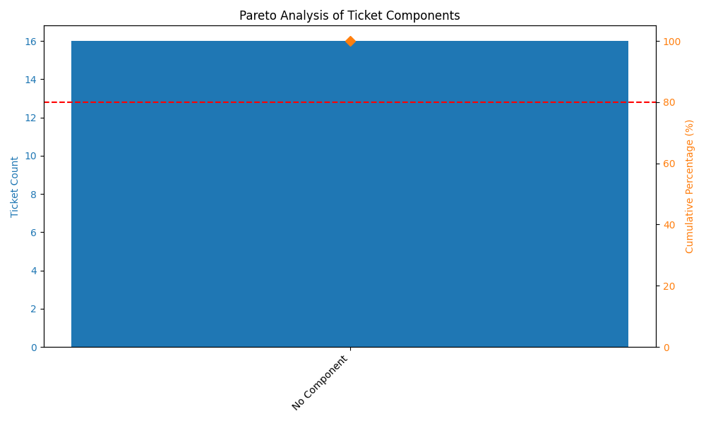

graph TD
    %% Internet/Cloud Boundary
    subgraph Internet_Cloud [☁️ Atlassian Cloud]
        Jira_API["Jira Cloud REST API v3   (sdas0112.atlassian.net)"]
    end

    %% Local Desktop Boundary
    subgraph Local_Desktop [💻 Saurya's Mac (Local Desktop)]
        
        %% Core Python Script
        subgraph Python_Venv [🐍 Python 3.9 Virtual Environment]
            Main_Script[main.py   (Orchestrator)]
            
            Config_Module[src/config.py]
            Jira_Module[src/jira_client.py]
            Visualizer_Module[src/visualizer.py]
            Analyzer_Module[src/analyzer.py   (Advisory Advisor)]
        end

        %% Local Model Server
        subgraph Ollama_Server [🐑 Ollama App (Running)]
            Llama_Model[Llama 3 (Quantized Model)]
        end

        %% Local Configuration and Output
        Env_File[.env File   (Credentials)]
        Data_Frame[Pandas DataFrame   (In-Memory Data)]
        
        %% Output Components
        advisory_report_md[ advisory_report.md  (Markdown Report)]
        pareto_png[pareto_chart.png   (Visualization)]
    end

    %% Connections and Data Flow
    Main_Script -.-> |"Reads"| Config_Module
    Config_Module -.-> |"Loads"| Env_File
    Main_Script ==> |"Calls"| Jira_Module
    
    %% Internet Traffic
    Jira_Module ==> |"1. Sends JQL Query   (HTTPS v3)"| Jira_API
    Jira_API ==> |"2. Returns Raw JSON Tickets"| Jira_Module
    
    %% Processing Data
    Jira_Module ==> |"3. Parses into"| Data_Frame
    Main_Script ==> |"4. Passes Data"| Visualizer_Module
    Main_Script ==> |"5. Passes Summaries/Stats"| Analyzer_Module
    
    %% Visualization
    Visualizer_Module ==> |"Saves"| pareto_png
    Visualizer_Module -.-> |"Displays"| plt_popup[Matplotlib Popup]
    
    %% LLM Connection (Local-Only)
    Analyzer_Module ==o |"6. Sends Prompt   (http://localhost:11434)"| Ollama_Server
    Ollama_Server ==> |"7. Runs Inference"| Llama_Model
    Llama_Model ==> |"8. Returns Analysis"| Analyzer_Module
    Analyzer_Module ==> |"Writes"| advisory_report_md
    Analyzer_Module -.-> |"Prints"| terminal_output[Terminal Console]
    
    %% Styling
    classDef cloud fill:#f9f,stroke:#333,stroke-width:2px,color:black;
    classDef local fill:#ccf,stroke:#333,stroke-width:2px,color:black;
    classDef venv fill:#dfd,stroke:#333,stroke-width:1px,color:black;
    classDef ollama fill:#ffe,stroke:#333,stroke-width:1px,style:dashed,color:black;

    class Internet_Cloud cloud;
    class Local_Desktop local;
    class Python_Venv venv;
    class Ollama_Server ollama;

    ## 📊 Sample Output
    